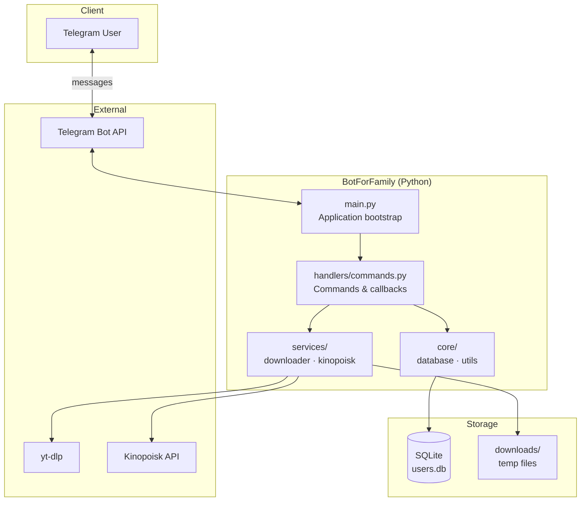

<div align="center">

# BotForFamily

**A production-ready Telegram bot for media downloads, search, and family access control**

[](https://www.python.org/)
[](https://core.telegram.org/bots)
[](https://www.sqlite.org/)
[](LICENSE)
[](https://github.com/vl2007s/botforfamily/actions)

*Built as a real-world home project — used daily by my family*

[Features](#-features) · [Architecture](#-architecture) · [Quick Start](#-quick-start) · [Tech Stack](#-tech-stack) · [Documentation](#-documentation)

</div>

---

## Overview

**BotForFamily** is a private Telegram bot that combines media tooling and lightweight admin features in one cohesive Python application.

Users can download videos and music from **YouTube** and **TikTok**, search content by name, look up movies via the **Kinopoisk API**, and receive watch links — all through an intuitive chat interface. Access is restricted to an allowlist stored in **SQLite**, with full admin tooling for user management, logging, and broadcast messaging.

This project demonstrates end-to-end backend development: external API integration, subprocess orchestration, persistent storage, role-based access control, and resilient long-running process design.

---

## Features

| Area | Capability |
|------|------------|
| **Media downloads** | YouTube & TikTok video/audio (MP3), quality selection (360p–1080p) |
| **TikTok** | Watermark-free video extraction via yt-dlp |
| **Search** | YouTube search by query with paginated inline results |
| **Movies** | Kinopoisk API search with ratings, year, and watch-link generation |
| **Access control** | SQLite allowlist — only approved Telegram users |
| **Admin panel** | User CRUD, download logs, per-user history, broadcast |
| **Reliability** | Auto-restart on crash, extended Telegram API timeouts for large files |

---

## Architecture



### Project structure

```
botforfamily/
├── config/settings.py      # Environment-based configuration
├── core/
│   ├── database.py         # SQLite schema, ACL, download logs, stats
│   └── utils.py            # URL validation & platform detection
├── handlers/commands.py    # Telegram handlers, inline keyboards, flows
├── services/
│   ├── downloader.py       # yt-dlp wrapper, search, format builders
│   └── kinopoisk.py        # Kinopoisk API client
├── main.py                 # Entry point, polling, crash recovery
├── requirements.txt
└── .env.example            # Secrets template (never commit .env)
```

> Detailed breakdown: [docs/ARCHITECTURE.md](docs/ARCHITECTURE.md)

---

## Tech Stack

| Layer | Technology |
|-------|------------|
| Language | Python 3.9+ |
| Bot framework | [python-telegram-bot](https://github.com/python-telegram-bot/python-telegram-bot) v20+ |
| Media engine | [yt-dlp](https://github.com/yt-dlp/yt-dlp) |
| Database | SQLite3 |
| HTTP client | Requests |
| Config | python-dotenv |
| Process | Long-polling with auto-restart |

### Skills demonstrated

- **Backend engineering** — modular service/handler architecture
- **External integrations** — Telegram Bot API, Kinopoisk REST API, yt-dlp CLI
- **Data persistence** — relational schema, logging, aggregated statistics
- **Security awareness** — secrets via env vars, allowlist ACL, no credentials in repo
- **UX in chat** — inline keyboards, pagination, multi-step download flows
- **Operations** — structured logging, crash recovery, file size guards

---

## Quick Start

### Prerequisites

- Python 3.9+
- FFmpeg (required by yt-dlp for MP3 conversion)

### 1. Clone & install

```bash
git clone https://github.com/vl2007s/botforfamily.git
cd botforfamily
python -m venv venv

# Windows
venv\Scripts\activate

# macOS / Linux
source venv/bin/activate

pip install -r requirements.txt
```

### 2. Configure environment

```bash
cp .env.example .env
```

| Variable | Description |
|----------|-------------|
| `BOT_TOKEN` | Token from [@BotFather](https://t.me/BotFather) |
| `ADMIN_ID` | Your Telegram ID from [@userinfobot](https://t.me/userinfobot) |
| `KINOPOISK_API_KEY` | Optional — [kinopoiskapiunofficial.tech](https://kinopoiskapiunofficial.tech/) |

### 3. Run

```bash
python main.py
```

### Deployment (PM2, survives reboots)

The bot auto-restarts on crashes by itself; PM2 adds boot persistence and supervision:

```bash
python -m venv venv
./venv/bin/pip install -r requirements.txt

pm2 start main.py --name botforfamily --interpreter /var/www/botforfamily/venv/bin/python
pm2 save
pm2 startup systemd -u root --hp /root   # prints a command — run it once
```

Updates: `git pull && pm2 restart botforfamily`. Logs: `pm2 logs botforfamily`
(the app also keeps a rotating `bot.log`, 5 MB × 3 backups).

---

## Bot Commands

### Users

| Command | Description |
|---------|-------------|
| `/start` | Welcome & usage guide |
| `/help` | Detailed instructions |
| `/status` | Bot health check |

**Also works:** send a YouTube/TikTok URL, or type any text to search YouTube / Kinopoisk.

### Admin

| Command | Description |
|---------|-------------|
| `/adduser <id> [name]` | Grant access |
| `/removeuser <id>` | Revoke access |
| `/users` | List allowed users |
| `/logs [N]` | Recent download logs (max 50) |
| `/userlogs <id>` | Logs for a specific user |
| `/broadcast <text>` | Message all users |

---

## Documentation

| Document | Contents |
|----------|----------|
| [docs/ARCHITECTURE.md](docs/ARCHITECTURE.md) | System design, data flow, module responsibilities |
| [docs/ROADMAP.md](docs/ROADMAP.md) | Planned improvements |
| [.env.example](.env.example) | Environment variables reference |

---

## Security

- Never commit `.env` — it contains live tokens
- Rotate bot token via @BotFather if exposed
- Designed for **private family use**, not public multi-tenant deployment
- User allowlist enforced on every handler

---

## Roadmap

See [docs/ROADMAP.md](docs/ROADMAP.md) for planned features: Docker deployment, unit tests, Redis rate limiting, and more.

---

## License

MIT — see [LICENSE](LICENSE).

---

<div align="center">

**Author:** Vladyslav Simonov · [@vl2007s](https://github.com/vl2007s)

*Open to international software engineering opportunities*

</div>
